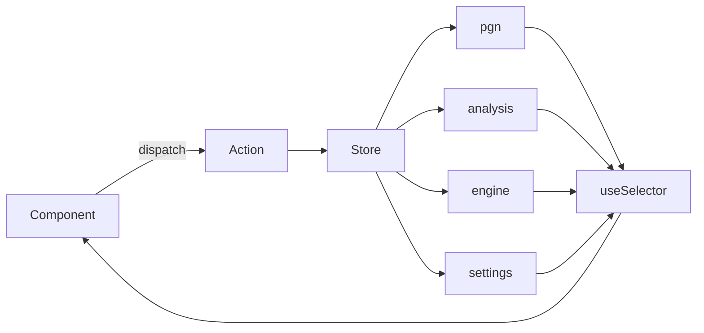

# ♟️ Chess Position Editor

A modern, interactive chess board editor built with **React**, **Redux**, and **TypeScript**. This tool allows users to visually create, edit, and analyze chess positions, supporting features like FEN input/output, board flipping, piece placement/removal, castling rights, and move toggling.

Visit https://abhi1kush.github.io/chess-frontend/ for Editing Fen or Chess positions.
---

Product Backlog:
* When user deviates from the move list and make move by dragging the piece, then anaylse this new position and show evalBar move category etc but keep it temporary dont need to store it
* Recognize book move and add in categorization. 
* Make available option of backend server analysis.
* Improve move category color mapping and icons.
* Moves should use icon of the piece instead of Alphabet.
* AI speaker who told us about review.

* DONE - Moves is categorized in multiple categories
* DONE - Board shows highlighted square and arrows for last move made.

## 🚀 Features

- 🧩 Drag & drop based **chess piece placement**
- 📋 **FEN** string input/output
- 🔁 **Flip board** orientation
- 🧹 **Clear** board and **reset** to the standard initial position
- 🔐 Toggle **castling rights**
- 🔄 Change **player to move**
- 🎨 Custom piece palette for manual editing
- 📱 Responsive design

---

## 🧱 Tech Stack

- ⚛️ React
- 🧠 Redux with Immer
- 🟦 TypeScript
- 🧪 Jest / React Testing Library *(if included)*
- 💅 Tailwind CSS or CSS Modules *(optional, depending on your setup)*

---

## 📂 App tree

`src/main.tsx` mounts Redux `Provider` + `store`, then `App`. Everything below is the runtime tree from `App`.

```
App
├── ConfigProvider
│   └── EngineProvider          (Stockfish WASM)
│       └── HashRouter
│           ├── PageViewTracker
│           └── AppRoutes
│               └── AnalysisPage            (/analysis)
│                   │
│                   │  hooks (not UI):
│                   │    useAnalysisLine
│                   │    usePositionAnalysis
│                   │    useAnalysisBoardView
│                   │
│                   ├── TopContainer
│                   │   └── TopBar
│                   │       ├── FlipButton
│                   │       ├── FenOverlayButton
│                   │       ├── PgnUploader
│                   │       ├── DarkThemeToggle
│                   │       └── Settings
│                   │
│                   ├── EngineSidebar   ← left column (fixed)
|                   |   |__ Score / Move Quality / Best Move
│                   │   └── GameReviewSummary   (after Review completes)
│                   │
│                   └── BoardStage              (.analysis-container)
│                       ├── EvalBar + ChessBoard
│                       └── sidebar    ← right column (fixed) 
│                           ├── MoveList
│                           │   ├── EngineWarmupBar
│                           │   ├── Review / Analyse
│                           │   ├── BoardControls          (mobile)
│                           │   └── MoveListTable
│                           │       └── MoveSanCell
│                           └── BoardControls              (desktop)
```

`MoveList` is the right-hand panel (buttons + review). `MoveListTable` is the `# / White / Black` grid inside it.

Redux slices used by this tree: `pgn`, `analysis`, `engine`, `settings` (`src/app/rootReducer.ts`).

### Source folders

```
src/
├── main.tsx
├── app/
│   ├── App.tsx
│   ├── routes.tsx
│   ├── store.ts
│   └── rootReducer.ts
├── features/
│   ├── analysis/     # page, move list, classifier, review
│   ├── chessboard/   # board, arrows, FEN helpers
│   ├── engine/       # Stockfish
│   ├── pgn/          # parser + uploader
│   └── settings/
└── shared/
```

## 🔄 Redux flow

Stockfish lives in `EngineProvider` (React context), **not** Redux. Redux only stores game data, the current ply, engine on/off, and settings.

```
 UI event (click, drop, upload)
        │
        ▼
 dispatch(action)     ← analysisActions / settingsActions / engineActions
        │
        ▼
 store (persisted)
        │
        ├── pgn        moves, fens, analysisData, reviewAnalysisComplete
        ├── analysis   currentMoveIndex, fenArrayLength
        ├── engine     enabled
        └── settings   isFlipped, theme, sound, playMovesDuringReview
        │
        ▼
 useSelector(...)     → AnalysisPage / MoveList / EngineSidebar / EvalBar
```

One action can update **more than one** slice. `LOAD_PGN` and `TOGGLE_ENGINE` are the two that fan out.



### State each slice owns

| Slice | What it stores | Who writes it |
|---|---|---|
| `pgn` | SAN list, FEN list, player names, `analysisData[]`, review done flag | PGN upload, FEN load, Review |
| `analysis` | `currentMoveIndex` (which ply the board is on) | Next/Prev, click a move, Review play-through |
| `engine` | `enabled` | Settings → Engine |
| `settings` | flip, theme, sound, play-through during review | Top bar / Settings |

`pgn.analysisData[i]` is the eval, best move, and classification **after** FEN `i`. The board’s current FEN is `pgn.fens[analysis.currentMoveIndex]`.

### Event chains

**1. Upload PGN or load a FEN**

```
PgnUploader / FenOverlayButton
  → loadPgn({ moves, fens, names, ... })
      → pgn: replace game, empty analysisData, reviewAnalysisComplete = false
      → analysis: currentMoveIndex = 0, fenArrayLength = fens.length
  → AnalysisPage re-reads both slices → board + move list reset
```

**2. Click a move (or Next / Prev)**

```
MoveListTable click  →  onJumpToMainLine(index)
BoardControls Next   →  jumpToMove / startPos / finalPosition
                         → analysis.currentMoveIndex
                         → useAnalysisLine sets position = fens[index]
                         → useAnalysisBoardView picks eval / arrows / highlight
                         → ChessBoard + EvalBar + EngineSidebar update
```

No PGN rewrite. Only the ply pointer moves.

**3. Start Review**

```
MoveList Review
  → useGameReview
      → setReviewAnalysisComplete(false)
      → startPos()                         // analysis: index 0
      → Stockfish reviewGame(fens)         // context, not Redux
      → per ply: classifyMove(...)
      → setPgnAnalysisAtIndex({ index, eval, bestMove, classification })
      → jumpToMove(index)                  // if play-through is on
      → setReviewAnalysisComplete(true)
  → EngineSidebar shows GameReviewSummary
  → EvalBar / Score / Move Quality read analysisData
```

**4. Analyse (current position only)**

```
MoveList Analyse
  → usePositionAnalysis.handleAnalyzeCurrentPosition
      → Stockfish analyzePosition(current FEN)   // local hook state
      → (optional) setPgnAnalysisAtIndex         // only if on main line and review is not complete
  → same displayEvalScore goes to EngineSidebar Score and EvalBar
```

Analyse does **not** classify moves. Review does.

**5. Flip / theme / engine toggle**

```
FlipButton     → FLIP_BOARD      → settings.isFlipped → ChessBoard + EvalBar
DarkThemeToggle / Settings
               → SET_THEME       → settings.theme
Settings engine switch
               → TOGGLE_ENGINE   → engine.enabled (and analysis.engineEnabled; same action type)
```

Persisted to `localStorage` (`persist:root`): `settings`, `analysis`, `pgn`. `engine` is not in the persist whitelist.

## 🧪 Getting Started

### 1. Clone the Repo

```bash
1. git clone https://github.com/your-username/chess-position-editor.git
cd chess-position-editor
2. Install Dependencies

npm install
# or
yarn install

3. Run the App
npm run dev
# or
yarn dev
Visit http://localhost:3000 in your browser.

🛠️ Usage
Click on a square to place or remove a piece.

Use the side palette to select a piece before placing.

Use toolbar buttons to:

Clear board

Reset to starting position

Flip board

Toggle castling rights

Change player to move

Generate FEN from current position

🌐 Future Enhancements
PGN Import / Export

Piece drag-and-drop support (with mobile touch support)

Keyboard shortcuts

Auto FEN validation

Light/Dark theme toggle
